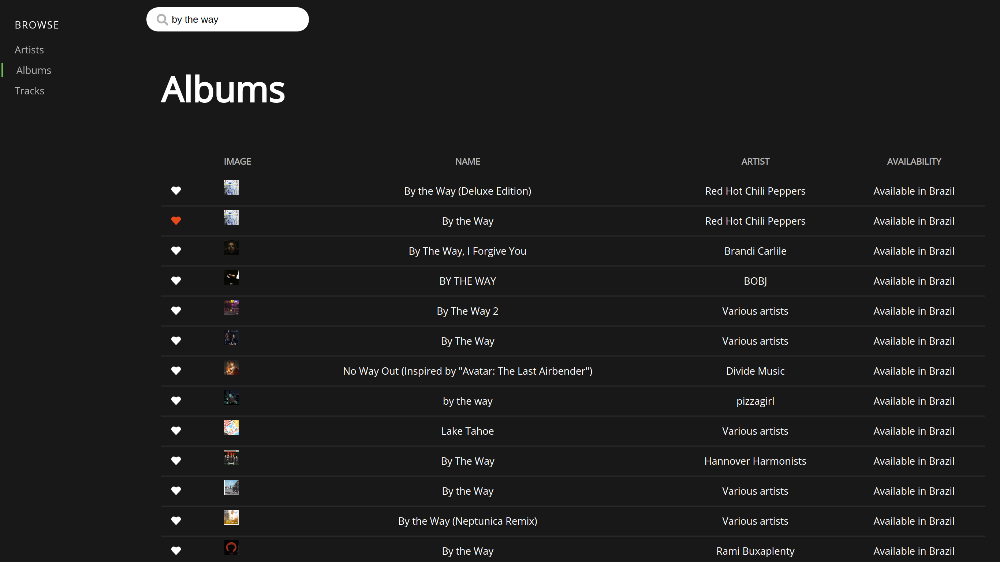
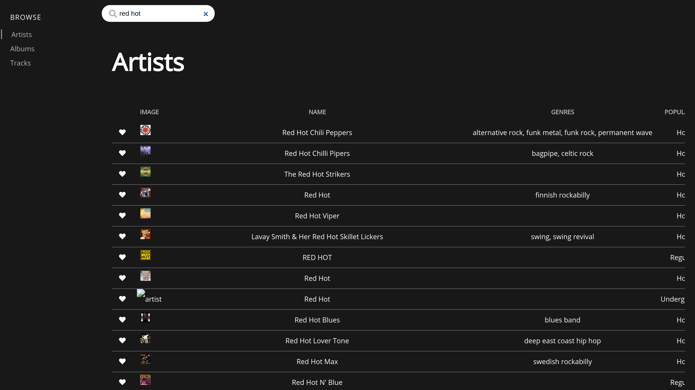

# Spotify Client PWA

An simple Spotify PWA client.

> This repository originally was created for the challenge at [HiPlatform](https://github.com/HiPlatform)

## Acknowledgements

- [React](https://reactjs.org/docs/getting-started.html)
- [Spotify API reference](https://beta.developer.spotify.com/documentation/web-api/reference/search/search/)

## Screenshots



---



---


## Run Locally

Clone the project

```bash
  git clone https://github.com/sebastiaomfneto/spotify-client-pwa.git
```

Go to the project directory

```bash
  cd spotify-client-pwa
```

Install dependencies

```bash
  npm install
```

Start the server

```bash
  npm run start
```

## Running Tests

To run tests, run the following command

```bash
  npm run test
```

## License

[MIT](https://choosealicense.com/licenses/mit/)
